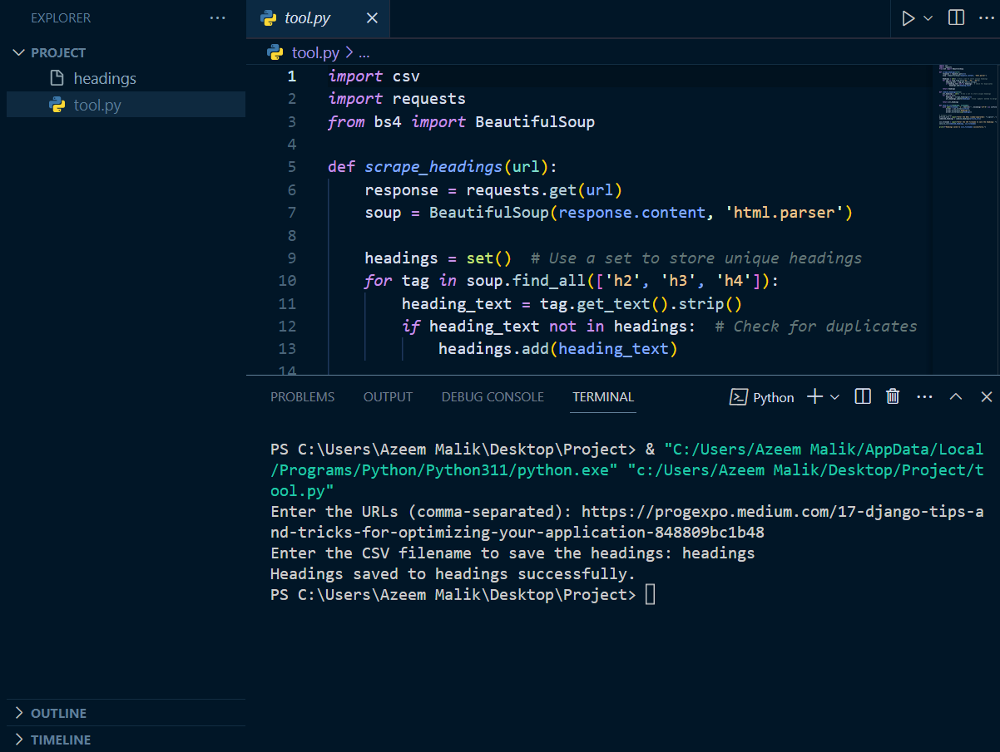
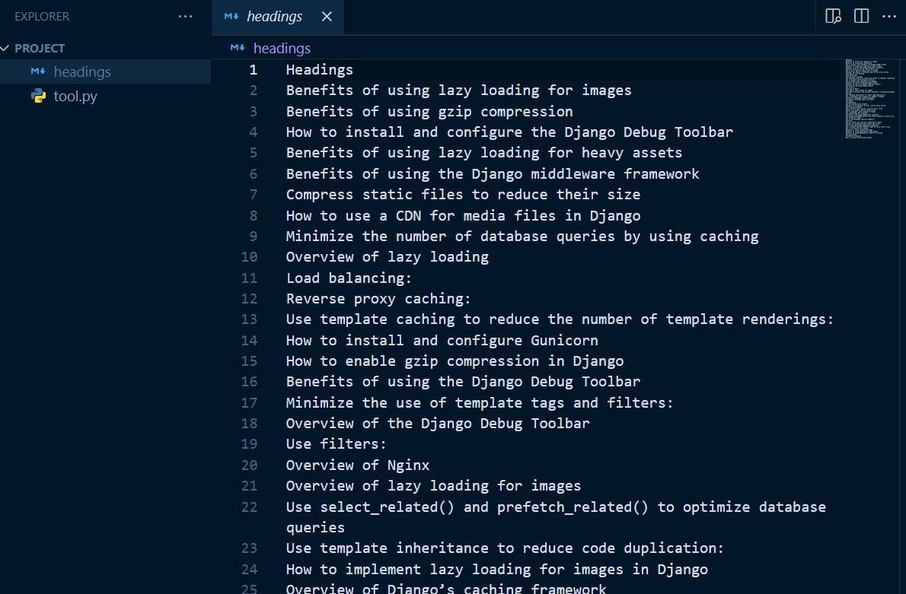

# Website Heading Scraper Tool

The Website Heading Scraper Tool is a Python script that allows you to scrape h2, h3, and h4 headings from one or multiple URLs. It utilizes the `requests` library to fetch the web page content and the `BeautifulSoup` library to parse the HTML and extract the headings.
## Previews

Website Heading Scraper Tool in action.

*Website-Heading-Scraper-Tool*

*Final Output of Website-Heading-Scraper-Tool*

## Features

- Scrapes h2, h3, and h4 headings from one or multiple URLs.
- Combines headings from multiple URLs into a single list.
- Eliminates duplicate headings to provide a unique list of headings.
- Saves the extracted headings to a CSV file for further analysis.

## Usage

1. Enter the URLs from which you want to scrape headings. You can provide multiple URLs separated by commas.
2. The script will fetch the web page content for each URL, extract the headings, and combine them into a single list.
3. Duplicate headings will be removed to provide a unique list of headings.
4. The extracted headings will be saved to a CSV file for easy analysis.

## Getting Started

1. Clone the repository: `git clone https://github.com/your-username/Website-Heading-Scraper-Tool.git`
2. Install the required dependencies: `pip install requests beautifulsoup4`
3. Run the script: `python website_heading_scraper.py`
4. Follow the prompts to enter the URLs and provide a filename for the CSV output.
5. The script will save the extracted headings to the specified CSV file.

## Requirements

- Python 3.6+
- `requests` library
- `beautifulsoup4` library
- `csv` module

## Contributions

Contributions are welcome! If you encounter any issues or have suggestions for improvements, please open an issue or submit a pull request.

## License

This project is licensed under the [MIT License](LICENSE).

## Acknowledgements

This tool was developed using the power of Python and popular libraries such as `requests` and `BeautifulSoup`. Special thanks to the open-source community for their valuable contributions.

## Disclaimer

Please note that this tool is intended for educational and research purposes only. The scraping of websites should be done responsibly and in compliance with the website's terms of service. Always ensure that you have proper authorization or permission before scraping any website.

## Contact

For any questions, suggestions, or feedback, please feel free to reach out to [https://progexpo.medium.com/].

We hope that the Website Heading Scraper Tool proves to be a useful resource for extracting and analyzing headings from websites. Happy scraping!
